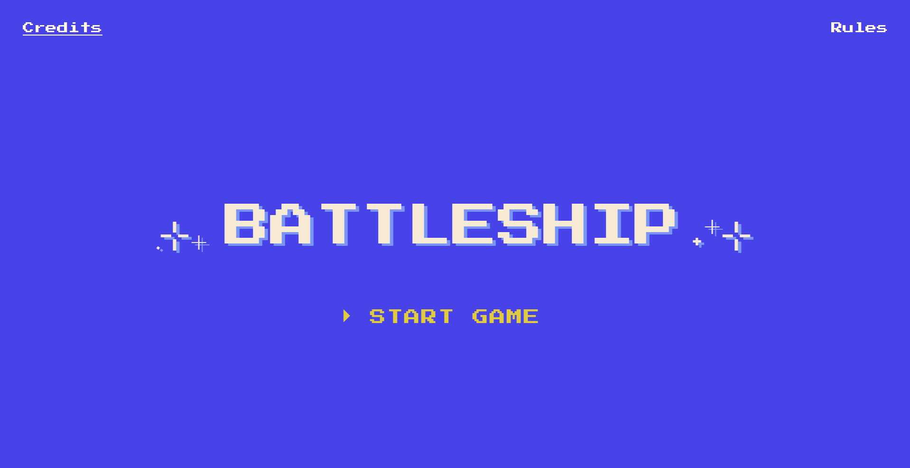
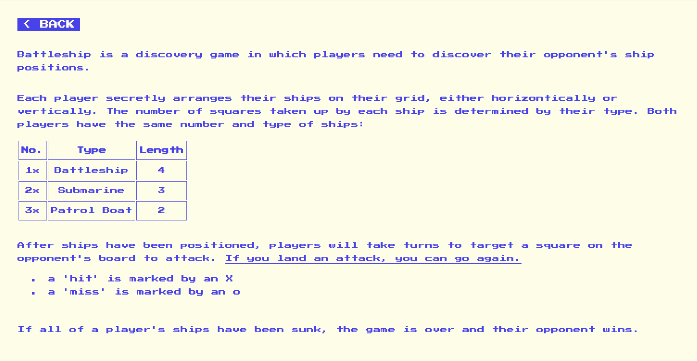
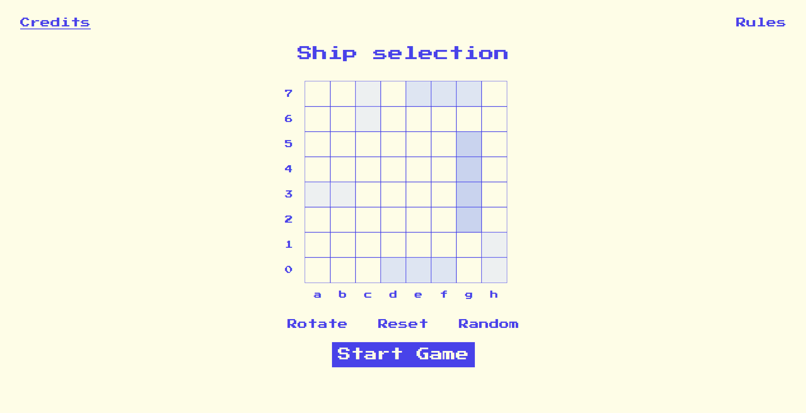
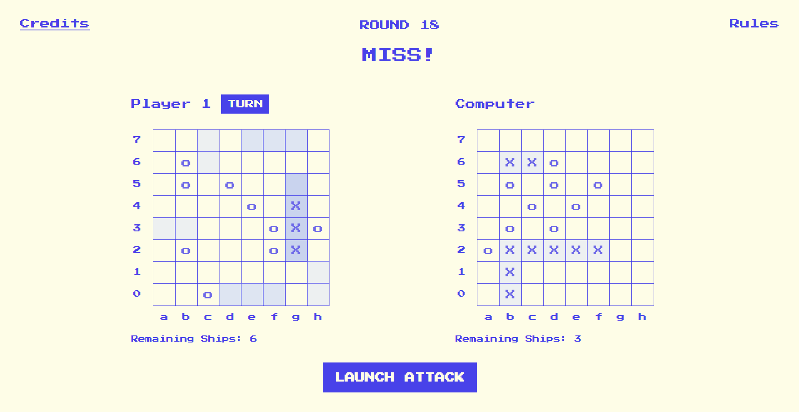

# Battleship

The Odin Project - JavaScript Course Project 11:

A Battleship game built using HTML, CSS, and JavaScript. The project follows Test-Driven Development (TDD) principles and uses Jest for unit testing.

## Preview

## Links

Live Link: https://luciavu.github.io/battleship/

Assignment: https://www.theodinproject.com/lessons/node-path-javascript-battleship
